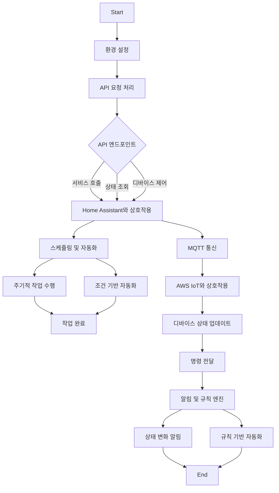

### 1. 시스템 전체 흐름 요약

이 프로젝트는 Python과 Flask를 기반으로 한 웹 애플리케이션으로, 스마트 홈 자동화를 지원하는 시스템입니다. 시스템의 주요 흐름은 다음과 같습니다:

1. **환경 설정**: 애플리케이션이 시작되면, `config()` 함수가 호출되어 필요한 디렉토리와 파일을 설정합니다. `.env` 파일을 통해 환경 변수를 로드하고, 필요한 리소스 파일이 존재하지 않으면 자동으로 생성합니다.

2. **API 요청 처리**: 사용자가 API 엔드포인트를 호출하면 Flask 라우트가 요청을 처리합니다. 각 엔드포인트는 Home Assistant와 상호작용하여 서비스 호출, 상태 조회, 디바이스 제어 등의 작업을 수행합니다.

3. **스케줄링 및 자동화**: `schedule` 라이브러리를 사용하여 주기적 작업과 조건 기반의 자동화 작업을 수행합니다. 이는 사용자가 정의한 규칙에 따라 자동으로 실행됩니다.

4. **MQTT 통신**: AWS IoT와의 MQTT 통신을 통해 디바이스를 등록하고 메시지를 전송합니다. 이는 실시간으로 디바이스 상태를 업데이트하고 명령을 전달하는 데 사용됩니다.

5. **알림 및 규칙 엔진**: 시스템은 상태 변화에 따라 사용자에게 알림을 전송하고, 사전 정의된 규칙에 따라 자동화된 작업을 수행합니다.

### 2. 주요 기능 요약

- **환경 설정 및 파일 관리**: 초기 설정 시 필요한 환경 변수와 파일을 관리합니다.
- **RESTful API 제공**: 다양한 API 엔드포인트를 통해 Home Assistant와 상호작용합니다.
- **스케줄링 및 자동화**: 주기적 작업과 조건 기반 자동화를 지원합니다.
- **MQTT 통신**: AWS IoT와의 통신을 통해 디바이스와 상호작용합니다.
- **알림 및 규칙 엔진**: 상태 변화에 따른 알림 전송과 규칙 기반 자동화를 수행합니다.

### 3. 전체 흐름을 표현한 Mermaid 플로우차트

이 문서는 프로젝트의 전반적인 흐름과 주요 기능을 요약하여 설명합니다. 플로우차트는 시스템의 주요 흐름을 시각적으로 표현하여 이해를 돕습니다.

## 상세 코드 분석

# 개발자 문서

## 1. 코드 설명 및 기능 요약

이 프로젝트는 Python과 Flask를 기반으로 한 웹 애플리케이션으로, 다양한 API 엔드포인트를 통해 Home Assistant와의 상호작용을 지원합니다. 이 애플리케이션은 주로 스마트 홈 자동화를 위한 기능을 제공하며, 다음과 같은 주요 기능을 포함합니다:

- **환경 설정 및 파일 관리**: `.env` 파일을 통해 환경 변수를 관리하며, 필요한 리소스 파일이 존재하지 않을 경우 자동으로 생성합니다.
- **API 엔드포인트**: 다양한 경로를 통해 Home Assistant의 서비스, 상태, 디바이스 등을 조회하거나 제어할 수 있는 RESTful API를 제공합니다.
- **스케줄링 및 자동화**: `schedule` 라이브러리를 사용하여 주기적 및 일회성 작업을 스케줄링하고, 조건에 따라 자동화된 작업을 수행합니다.
- **MQTT 통신**: AWS IoT와의 MQTT 통신을 통해 디바이스 등록 및 메시지 전송을 수행합니다.
- **알림 및 규칙 엔진**: 상태 변화에 따른 알림 전송과 규칙 기반의 자동화 작업을 지원합니다.

## 2. 주요 함수/클래스 설명

### `app.py`

- **`config()`**: 필요한 디렉토리와 파일을 생성하여 환경을 설정합니다.
- **Flask 라우트**: 다양한 API 엔드포인트를 정의하여 Home Assistant와의 상호작용을 지원합니다. 예를 들어, `/local/api/config/ha/cert`는 Home Assistant의 인증서를 설정하는 엔드포인트입니다.

### `generate_docs.py`

- **`get_source_files()`**: 프로젝트의 소스 파일을 수집합니다.
- **`generate_dev_docs()`**: OpenAI API를 사용하여 소스 코드로부터 개발자 문서를 생성합니다.
- **`convert_md_to_pdf()`**: 생성된 Markdown 문서를 PDF로 변환합니다.

### `libs/edit.py`

- **`deleteItem()`**: 리스트에서 특정 키 값을 가진 항목을 삭제합니다.
- **`putItem()`**: 리스트에 새로운 항목을 추가하거나 기존 항목을 업데이트합니다.
- **`update_env_file()`**: `.env` 파일의 특정 키 값을 업데이트합니다.

### `sub/configure.py`

- **`change_entity_alias()`**: 디바이스의 별칭을 변경합니다.
- **`change_room_alias()`**: 방의 별칭을 변경합니다.

### `sub/localIp.py`

- **`get_local_ip()`**: 로컬 IP 주소를 반환합니다.
- **메인 루프**: 주기적으로 로컬 IP를 특정 서버로 전송합니다.

### `sub/mqtt.py`

- **`AWSIoTClient` 클래스**: AWS IoT와의 MQTT 연결 및 디바이스 등록을 관리합니다.
- **`mqtt_callback()`**: MQTT 메시지를 수신하고 처리합니다.

### `sub/notifier.py`

- **`notifier` 클래스**: 알림을 관리하고 상태 변화에 따라 알림을 전송합니다.
- **`notify_to_url()`**: 조건이 충족되면 특정 URL로 알림을 전송합니다.

### `sub/ruleEngine.py`

- **`rule_engine` 클래스**: 규칙을 관리하고 상태 변화에 따라 규칙을 실행합니다.
- **`executeActions()`**: 규칙의 조건이 충족되면 지정된 액션을 실행합니다.

### `sub/scheduler.py`

- **`one_time_schedule` 클래스**: 일회성 스케줄을 관리합니다.
- **`schedule_config()`**: 스케줄을 설정하고 주기적 및 일회성 작업을 스케줄링합니다.
- **`periodic_scheduler()`**: 주기적 작업을 실행합니다.
- **`one_time_scheduler()`**: 일회성 작업을 실행합니다.

이 문서는 프로젝트의 전반적인 구조와 주요 기능을 이해하는 데 도움을 줄 것입니다. 각 파일과 함수의 역할을 명확히 이해하고, 이를 바탕으로 프로젝트를 확장하거나 유지보수할 수 있습니다.
